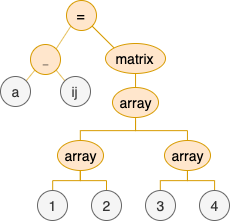

# Matrices

## Define a Matrix

| | |
| --- | --- |
| Pretty Math Display |  |
| Calchub Syntax | `a_{ij} = \matrix{[[1, 2], [3, 4]]}` |
| Math Tree |  |

## Matrix Transpose

| | |
| --- | --- |
| Pretty Math Display |  |
| Calchub Syntax | `b_{ij} = a_{ij}^{T}` |
| Math Tree |  |

## Index Notation

| | |
| --- | --- |
| Pretty Math Display |  |
| Calchub Syntax | `c = \access{a,i,1}` |
| Math Tree |  |
