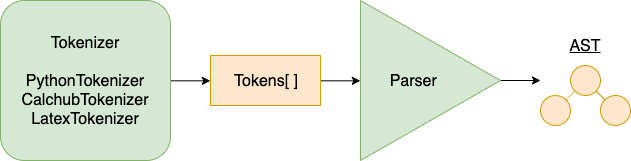
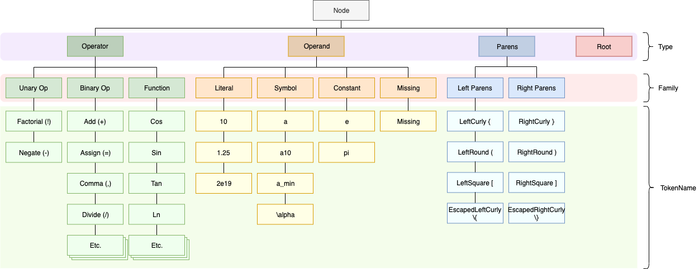
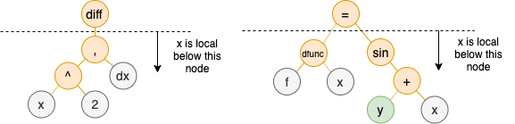
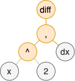

# Parsing Expressions

## Requirements

- Should be able to easily add additional grammars, (python, latex, ascii, etc.)
- Should preserve the structure of the input in the tree. (parenthesis, etc.)
- Should be able to build a usable tree for ANY input string. This allows the Pretty Math editor to do syntax highlighting in real-time while the user is editing an expression.



This architecture allows us to easily add additional syntaxes in the future. It also keeps the parser logic completely separate from the syntax. All syntax translation happens in the tokenizers.

## Tokenizers

Every unique function, operator, and operand that the Parser is aware of has a respective `TokenName`. This allows us to support any number of syntax. As long as the Tokenizer can translate the syntax into these tokens, then we can understand it. For example, it the `calchub` math syntax the `^` char represents the power binary operator, but in python the `**` characters represent power. As long as the Tokenizers translate these characters into the `TokenName.Power` token, then the Parser will handle it properly.

Here is a subset of the valid token names that the parser understands. For a full list, see the `parser/Tokens.ts` file.   

```
enum TokenName {
    Space,
    
    // Binary Operators
    Add,
    Subtract,
    Power,
    etc...
    
    // Trig Functions
    Sin,
    Cos,
    etc...
    
    // Arithmetic
    Abs,
    Ln,
    Log,
    Frac,
    etc...
    
    // Parens
    LeftCurlyParens,
    LeftParens,
    RightParens,
    etc...
    
    Operands
    Literal,
    Symbol,
    etc...
    
}
```

### User Defined Functions

User Defined Functions are functions that have been defined externally, so the parser should treat them as functions. `f(x)=x^{2}` this expression defines a function named `f`. Another expression could then invoke that function like this `f(4)`. In this expression the `f` word should be treated as a function and not a symbol.

We can tell the parser about externally defined functions by passing in a list of function names, `['f']`. The parser will then treat any symbol tokens with `tokenValue: 'f'` as a function, instead of a symbol. 

**Actual implementation details**

- Treat all symbols as symbols first
- post walk the tree and find implict multiplication nodes function names on the left. Replace these nodes with a UserDefinedFunctionInvocation node.

## Parser

The parser takes a Token list and attempts to generate an Abstract Syntax Tree (AST). The tree consists of Operator Nodes and Leaf nodes or Operand Nodes.

### Classifying Nodes



There are three different ways that nodes are classified: `NodeType`, `NodeFamily`, `TokenName`. Each one getting more specific.

**`NodeType`**

`NodeType` is the most general. The parser uses the node type to determine how to process the node while building the AST. The possible types are: `Operator`, `Operand`, `Parens`, `Root`. Operator and Parens nodes start on the `opStack` and make their way to the `outputStack` and Operands go directly to the `outputStack`.

**`NodeFamily`**

The next level of classification is the `NodeFamily`. Here's a list of the families and a short description.

| Family | Description | 
| --- | --- |
| `BinaryOp` | An infix binary operator like `1+2`, `a-b`, `c^2`, `y=x`|
| `Constant` | A defined mathematical constant like `\pi` |
| `Func` | A function like `sin{6}` or `max{1,2}` |
| `Invalid` | ?? |
| `LeftParens` | Any left parens `(`, `{`, `[`, or `\{` |
| `Literal` | A literal number like `10`, `2.45`, `10e5` |
| `LocalSymbol` | A symbol node that is locally scoped. `f(x) = x^2` => `x` is locally scoped in this case |
| `Missing` | The parser attempts to add nodes where there are missing operands |
| `Reserved` | Not used. |
| `RightParens` | Any right parens `)`, `}`, `]`, or `\}` |
| `Symbol` | Really any word that is not a function or constant `x`, `foo123`, etc. |
| `TableRange` | Not used. Will be implemented once we bring back DataTables. |
| `UnaryOp` | An operator that only takes on operand |


**`TokenName`**

The `TokenName` is the most specific classification. There is a different `TokenName` for every unique operator, function, parens type, etc. that is supported. See the Tokens section for more information. A node's token name comes directly from it's associated Token. From the token name we can derive the node's family and type. This happens in the `nodes/NodeBuilder.ts` module.

### Parentheses

Each different parentheses type has it's own `TokenName` but belongs to either the `LeftParens` or `RightParens` node family. Assigning each parens a unique `TokenName` allows the parser to find unbalanced parens like `(20 + 1]`. It also allows the parser to treat curly parens `{}`, differently.

This allows the parser to The parser treats non-escaped parens differently than other parens. It's also required to find unbalanced parens errors, since parens pairs must be of the same type. `(20 + a]` would be considered unbalanced parens.

| Char | TokenName | Node Family |
| :---: | --- | --- |
| `\{` | EscapedLeftCurlyParens | LeftParens |
| `{` | LeftCurlyParens | LeftParens |
| `(` | LeftRoundParens | LeftParens |
| `[` | LeftSquareParens | LeftParens |
| `\}` | EscapedRightCurlyParens | RightParens |
| `}` | RightCurlyParens | RightParens |
| `)` | RightRoundParens | RightParens |
| `]` | RightSquareParens | RightParens |

**Preserving Parens**

TDB. The parser should have the ability to preserve parentheses. In this case, the AST would actually include Parentheses operator nodes.


### Implicit Multiplication

Implicit multiplication is supported in the following cases.

| Case | Example Expression | Evaluated as |
| :-- | :-- | :-- |
| **[literal] [symbol]** | `2pi` | `2 * pi` |
| **[right parens] [literal]** | `(a + 1)5` | `(a + 1) * 5` |
| **[right parens] [left parens]** | `(a + 1)(a - 1)` | `(a + 1) * (a - 1)` |
| **[literal] [left parens]** | `2(a - 1)` | `2 * (a - 1)` |
| **[symbol] [left parens]** | `a(a - 1)` | `a * (a - 1)` |
| **[literal] [func]** | `5sin(a)` | `5 * sin(a)` |
| **[literal] [func]** | `\{3\}\{4\}` | `3 * 4` |

Implicit Multiplication has a higher precedence than explicit multiplication, division and power.

| Example Expression | Evaluated as |
| :-- | :-- |
| `1 / 2pi` | `1 / (2 * pi)` |
| `a * 2a` | `a * (2 * a)` |
| `5 ^ 2a` | `5 ^ (2 * a)` |
| `5 ^ 2 * a` | `(5 ^ 2) * a` |

Not Implicit

| Case | Example Expression | Evaluated as |
| :-- | :-- | :-- |
| **[symbol] [literal]** | `a 4` | would throw syntax error |
| **[right curly] [left curly]** | `{2}{4}` | Would not add implicit multi here, since `\frac{1}{2}` |

### Local Symbols

Local Symbols are symbols that should be scoped to the expression and not replaced by globally defined variables. This happens in the following situations.

| Expression | Notes |
| --- | --- |
| `\dfunc{f, x} = x^{2} + y`| In this case, the `x` is a local symbol but the `y` is global. |
| `\diff{x^{2} + z, dx}` | `x` is local here since the expression is calculating the derivative with respect to `x`, but `z` is global. |

Local Symbols have their own `TokenName` to differentiate them from global symbols. This distinction is important when we are resolving a deep tree and when PrettyMath is decorating blocks. When resolving a deep tree, Local Symbols should not be replaced with the tree's of globally defined variables. And when decorating blocks, Local Symbols should not adopt the color of a globally defined variable with the same name.

**Uncovering Local Symbols**

When the parser builds an AST, it treats every Symbol node it encounters the same because it doesn't have enough information to determine if a symbol should be locally scoped. This information becomes clear after the complete tree has been built. Once we have a complete tree, we can walk it, find local symbols and replace the symbol nodes with Local Symbols.



### Missing Operands

It would be helpful if the Parser could still build a valid AST even when some of the operators are missing operands. This comes in handy when a user is in the middle of editing a math expression, and has an incomplete expression. If the parser adds in missing operands, then it is still able to build an AST and pretty math can properly decorate it's blocks.

How do we determine where the missing operands should be?

We can iterate through our list of nodes and inspect all Operator Nodes and Parens Nodes. Depending on the type of operator, we can look at either the node before, after or sometimes before and after. There is a finite number of posibilities for the types of nodes we will see on either side. They are...

- `null`, no node
- Operand
- Left Parens
- Right Parens
- Left Associative Unary Operator
- Right Associtave Unary Operator
- Binary Operator
- Function


Below are the outcomes for each unique situation.

**Left Associative Unary Operator**

A unary operator whose operand is expected to be on the left. eg: factorial (`!`)

| | | | |
| --- | --- | --- | --- |
| *node on left* | orientation | ok? | example |
| null: | **[null] [unary]** | ❌ | `!` |
| operand: | **[operand] [unary]** | ✅ | `5!` |
| left parens: | **[left parens] [unary]** | ❌ | `(!` |
| right parens: | **[right parens] [unary]** | ✅ | `)!` |
| left assoc unary: | **[left assoc unary] [unary]** | ✅ | `5!!` |
| right assoc unary: | **[right assoc unary] [unary]** | ❌ | `-!` |
| binary op: | **[bo] [unary]** | ❌ | `+!` |
| function: | **[func] [unary]** | ❌ | `sin !` |
| *node on right* | |
| | ***not applicable*** | |

**Right Associative Unary Operator**

A unary operator whose operand is expected to be on the right. eg: unary minus (`-`)

| | | | |
| --- | --- | --- | --- |
| *node on left* | orientation | ok? | example |
| | ***not applicable*** | |
| *node on right* | |
| null: | **[unary]** | ❌ | `-` |
| operand: | **[unary] [operand]** | ✅ | `-5` |
| left parens: | **[unary] [left parens]** | ✅ | `-(` |
| right parens: | **[unary] [right parens]** | ❌ | `-)` |
| left assoc unary: | **[unary] [left assoc unary]** | ❌ | `-!` |
| right assoc unary: | **[unary] [right assoc unary]** | ✅ | `--4` |
| binary op: | **[unary] [bo]** | ❌ | `-+` |
| function: | **[unary] [func]** | ✅ | `- sin` |

**Binary Operator**

An operator that expects an operand on both the left and the right.

| | | | |
| --- | --- | --- | --- |
| *node on left* | orientation | ok? | example |
| null: | **[bo]** | ❌ | `+5` |
| operand: | **[operand] [bo]** | ✅ | `5+4` |
| left parens: | **[left parens] [bo]** | ❌ | `(+` |
| right parens: | **[right parens] [bo]** | ✅ | `)+2` |
| left assoc unary: | **[left assoc unary] [bo]** | ✅ | `5!+3` |
| right assoc unary: | **[right assoc unary] [bo]** | ❌ | `-+` |
| binary op: | **[bo] [bo]** | ❌ | `*+` |
| function: | **[func] [bo]** | ❌ | `sin +` |
| *node on right* | |
| null: | **[bo]** | ❌ | `1+` |
| operand: | **[bo] [operand]** | ✅ | `1+5` |
| left parens: | **[bo] [left parens]** | ✅ | `+(` |
| right parens: | **[bo] [right parens]** | ❌ | `+)` |
| left assoc unary: | **[bo] [left assoc unary]** | ❌ | `+!` |
| right assoc unary: | **[bo] [right assoc unary]** | ✅ | `1+-4` |
| binary op: | **[bo] [bo]** | ❌ | `++` |
| function: | **[bo] [func]** | ✅ | `+ sin` |

**Function**

A named operator who expects an operand on the right.

| | | | |
| --- | --- | --- | --- |
| *node on left* | orientation | ok? | example |
| | ***not applicable*** | |
| *node on right* | |
| null: | **[func]** | ❌ | `sin` |
| operand: | **[func] [operand]** | ✅ | `sin 5` |
| left parens: | **[func] [left parens]** | ✅ | `sin(` |
| right parens: | **[func] [right parens]** | ❌ | `-sin)` |
| left assoc unary: | **[func] [left assoc unary]** | ❌ | `sin !` |
| right assoc unary: | **[func] [right assoc unary]** | ✅ | `sin -4` |
| binary op: | **[func] [bo]** | ❌ | `sin +` |
| function: | **[func] [func]** | ✅ | `sin sin` |

**Left Parens**

Not really an operator, but it separates the order of operation. It says, do everything inside of me first, then I become like an operand.

So the only thing we should worry about is if it is empty.

| | | | | |
| --- | --- | --- | --- | --- |
| *node on left* | orientation | ok? | example | |
| | ***not applicable*** | | |
| *node on right* | | |
| null: | **[(]** | ❌ | `(` | not ok, but this would cause a unbalanced parens error |
| operand: | **[(] [operand]** | ✅ | `(5` |
| left parens: | **[(] [left parens]** | ✅ | `((` |
| right parens: | **[(] [right parens]** | ❌ | `()` | This is the only case, when we should insert a missing node |
| left assoc unary: | **[(] [left assoc unary]** | ❌ | `(!` | not ok, but the unary function would catch this too |
| right assoc unary: | **[(] [right assoc unary]** | ✅ | `(-4` |
| binary op: | **[(] [bo]** | ❌ | `(+` | not ok, but we would catch it when we looked at the binary op |
| function: | **[(] [func]** | ✅ | `(sin` | |  


## Exception Handling

There are two types of exceptions that can occur: warnings and errors. A warning means that the Tokenizer or the Parser is able to continue without the risk of improperly forming the AST. These types of expections are appended to a warnings array which is returned with the `ParseResult`. An `Error` is thrown when either the Tokenizer or the Parser encounters a problem that could result in a malformed AST. In this case, the expection is thrown and no AST is returned.

**Errors**

- unbalanced parens
    - (1 + 2
- invalid character
    - 😃
- missing arguments
    - (1 + )
- invalid arguments 
    - An operator has the correct number of operands, but the operands are of the wrong type.
    - adding two matrices of different sizes
- invalid literals
    - 10e (forgot the argument for the exponential)
    - 1. (no decimals)


## Derivatives

The derivative function has the following signature: `\\diff{x^2,dx}` First operand is the expression to differentiate, the second operand is the string representation of the differential. This must be parsed before sending to the python server.

And the AST would look like this.



`\diff{x^2,\wrt{x}\pwrt{y}}`

## Matrices

`\matrix{[[1,2],[3,4]]}`

A Matrix must have one argument that is an array, and that array must contain arrays. The parser will throw an exception if this is not true.

`\matrix{2}`, `\matrix{[1]}`, `\matrix{[1],[2]}` all invalid


