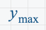
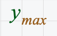

# Subscripts

In most coding languages, subscripts are simply part of a variable name. For instance, in JavaScript, you can define a variable `const a_1 = 10`. The JavaScript parser treats the subscript as part of the word and defines a variable `a_1`.

In math, subscripts can have two different meanings:

1) variable identifiers
2) matrix index accessors

When a subscript is behaving as a variable identifier, it can be thought of as an 
extension to the variables name. Here is an example of a subscript being used as a variable identifier.

In this case, the subscript is non-italicized and the same color as the y. This whole string of characters represents one variable.

When a subscript is behaving as a matrix index accessor, the two parts represent different things. Here is an example of a subscript being used as a matrix index accessor.

In this case, the subscript is italicized, just as a non-subscripted variable would be. It's also a different color than the y, because it represents a different entity. This expression says, given a matrix (or vector) `y`, give me the index at whatever integer `max` resolves to.

At CalcHub, our goal is to make our math editor extremely intuitive. To this end, we attempt to infer our user's intention as much as possible. But this is a case where we need a little help from the user. 

We will require the user to tell us whether or not they are intending to treat the subscript as an identifier or as a matrix accessor.

this is a variable identifier

`y_max`

A vector accessor

`\access{y, max}`

A matrix's row accessor

`\access{M, 1, j}`

A matrix's item accessor

`access{M, 1, 1}`

In pretty math, we will have a special `MatrixIndexAccessorBlock` which must be inserted by picking it from the assistant.
